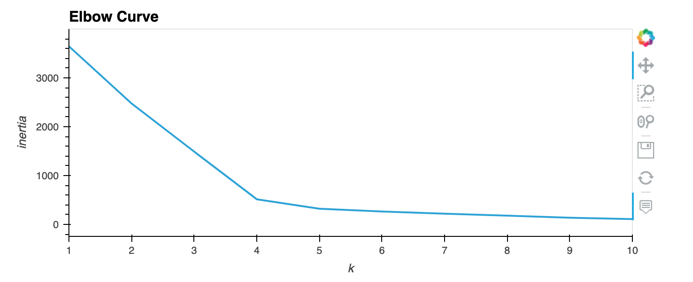

# Cryptocurrencies

## Overview
In this module we analyzed a dataset containing different cryptocurrencies that are being traded.

## Process

### Cleaning the data
The first step was to clean the data in order to get it into a format suitable for machine learning.  We narrowed and cleaned the data by filtering the data as follows:
    * Only those CoinNames that were trading:  `crypto_df = crypto_df[crypto_df['IsTrading'] == True]`.  
    * Dropped all rows that had at least 1 null value:  `crypto_df = crypto_df.dropna()`
    * Kept only the rows were Coins were mined: `crypto_df = crypto_df[crypto_df['TotalCoinsMined'] !=0]`
    * Utilized get_dummies to create variables for text features `X = pd.get_dummies(crypto_df, columns=['Algorithm', 'ProofType'])`
    * Standardized the data using Standard Scaler `X_scaled = StandardScaler().fit_transform(X)`

### Reducing the Data Dimensions using PCA
The next step we used PCA to narrow down 3 principal components.  We then created an Elbow curve to determine the best value for K to utilize in the K-Means model:

We then ran the data thru the K-Means model using n_clusters of 4, followed by visualizing the data in a 3D plot and creating a table of the data:

### Scaling the Data
We used further code to scale the TotalCoinSupply and TotalCoinsMined fields utilizing the MinMaxScaler method: `clustered_scaled = MinMaxScaler().fit_transform(clustered_df[['TotalCoinSupply', 'TotalCoinsMined']])`.  Finally we produced a 2D scatter plot

